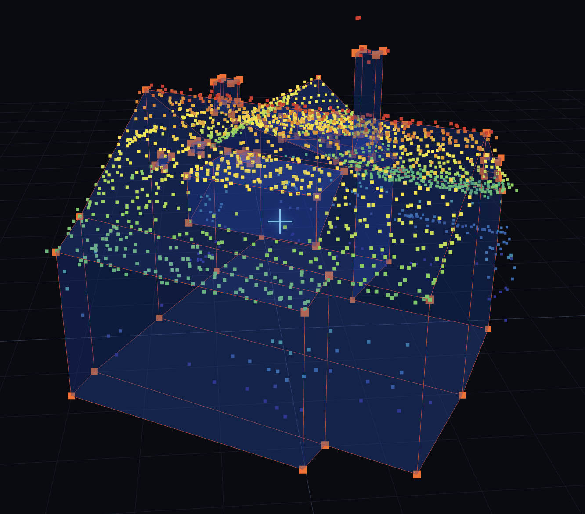

# 3Dlabel

[Paper (TODO)](TODO_PAPER_URL) · [API reference](#api-reference) · [Citation](#citation)

## Overview

Annotate buildings and roof details from point clouds. Draw surfaces, extrude them into solids, and export editable annotations and meshes. Open your own files or acquire houses from the Swiss map.

3Dlabel runs independently of [Emboss](https://github.com/tobiasvonarx/emboss), sharing only its building acquisition package.



## Installation

Install [uv](https://docs.astral.sh/uv/), GDAL **3.13.0** with development headers (`gdal-config` on `PATH`), and a C/C++ compiler. Also install [Node.js](https://nodejs.org/) (24+) and [pnpm](https://pnpm.io/).

```bash
git clone https://github.com/tobiasvonarx/3Dlabel.git
cd 3Dlabel
uv sync --locked
cp .env.example .env
pnpm install --frozen-lockfile
pnpm run build
```

uv installs the project's Python version and locked dependencies in a separate environment. If GDAL is outside the standard library path, set `NATIVE_PREFIX` in `.env` to its installation directory.

## Getting started

From the repository directory, run:

```bash
uv run --locked label3d
```

Open **http://127.0.0.1:5003**.

1. Choose **Acquire from map**, open a saved scene, or load your own point cloud.
2. Draw roof surfaces. Select a face and press **D** to extrude; press **?** for shortcuts.
3. Save your work. Library scenes save in place; local files download `annotations.json` and `mesh.ply`.

On narrow screens, the canvas stays above the drawing tools. Open **Scene** for validation and exports, or **View** for display controls. Close a panel with Escape or its close button to return to the canvas.

Swiss acquisition includes terrain and downloads about 13 GB of building data on first use, plus cached tiles. Your own point clouds need neither these downloads nor a segmentation model.

Data and results are saved in `./data`. Edit [.env](.env.example) to change `PORT`, `DATA_DIR`, `WORKERS`, then restart.

## API reference

### HTTP

Start the app first. [Interactive API documentation](http://127.0.0.1:5003/docs) describes all endpoints.

List scenes and their asset URLs:

```bash
curl http://127.0.0.1:5003/api/scenes
```

Acquire buildings through the map or `POST /api/acquisition`, then create scenes from the returned house IDs:

```bash
curl -X POST http://127.0.0.1:5003/api/scenes/acquired \
  -H 'Content-Type: application/json' \
  -d '{"houses":["HOUSE_ID"]}'
```

Replace `HOUSE_ID` with an acquired ID. The response contains scene `ids`, refreshed `scenes`, and per-house `failures`. Existing annotations are preserved.

| Method | Endpoint | Purpose |
| --- | --- | --- |
| GET | `/api/health` | Check application status |
| POST | `/api/acquisition` | Acquire a house or area |
| GET | `/api/acquisition/JOB_ID` | Poll acquisition progress |
| GET | `/api/houses` | List acquired buildings |
| GET | `/api/scenes` | List library scenes and asset URLs |
| POST | `/api/scenes/acquired` | Create scenes from acquired buildings |
| POST | `/api/scenes/save` | Save annotations, mesh, or alignment |
| GET | `/api/scenes/files/SCENE_ID/FILENAME` | Read a scene asset |

Acquisition accepts `{"mode":"house","longitude":7.055825,"latitude":46.779828}` or `{"mode":"area","bbox":[west,south,east,north]}` in WGS84 longitude/latitude.

### Saving annotations

Use an ID from `/api/scenes`. For example, a `save.json` payload for an empty wireframe is:

```json
{
  "id": "0/collection/house",
  "annotationJson": "{\"vertices\": [], \"edges\": [], \"faces\": []}"
}
```

Replace the ID and annotation content with your scene's data, then submit:

```bash
curl -X POST http://127.0.0.1:5003/api/scenes/save \
  -H 'Content-Type: application/json' \
  --data-binary @save.json
```

`annotationJson` is a JSON string. Optional `meshPly` supplies PLY text; explicit `null` removes the saved mesh. Omitted fields are preserved. Optional `earthAlignment` stores `de`, `dn`, and `dh` offsets in metres. Saves are limited to 50 MB.

### Scene bundles

Place a bundle under `data/scenes/<collection>/<house>/`:

```text
house/
├── scene.json
├── points.las
├── dem.tif          # Optional terrain
├── annotations.json # Written when saving
└── mesh.ply         # Exported mesh
```

Example `scene.json`:

```json
{
  "schema": "label3d-scene-v1",
  "name": "Example house",
  "crs": "EPSG:2056",
  "points": "points.las",
  "dem": "dem.tif"
}
```

Paths are relative to the bundle. Points may be LAS, PLY, or XYZ; omit `dem` if no terrain is supplied. Optional `building_outline` references scaffold GeoJSON. `focus_extent` is `[min_x, min_y, max_x, max_y]`, and `base_height` supplies a framing hint. All assets and exported coordinates use the scene CRS.

## Citation

TODO: add the paper citation and BibTeX entry.
